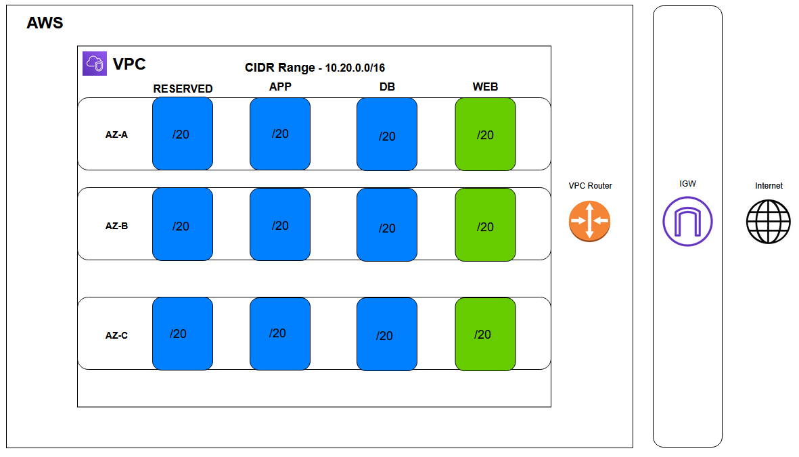

## network module

This module configures the following architecture

1. VPC with CIDR Range - 10.20.0.0/16
1. 3 **/20** Public Subnets for the Web Tier across 3 AZs
1. 9 **/20** Private Subnets for the App, DB and Reserverd Tiers across 3 AZs
1. IGW with default routes to route traffic from the public subnets with IPv4 Addresses
1. Egress-only IGW with default routes to route traffic from the public subnets with IPv6 Addresses

